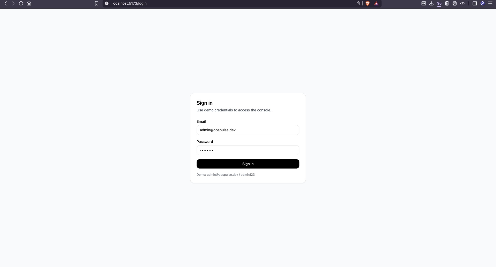
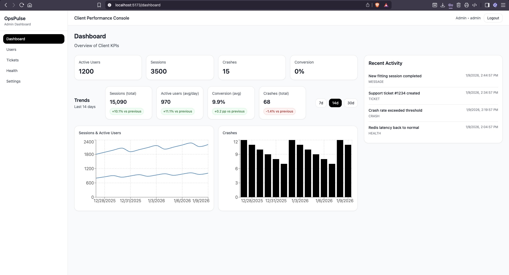
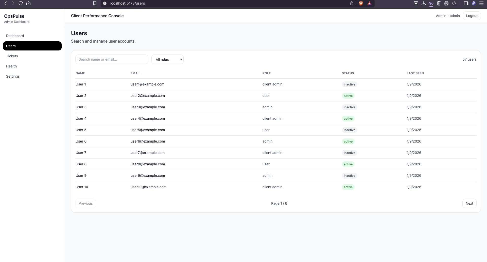
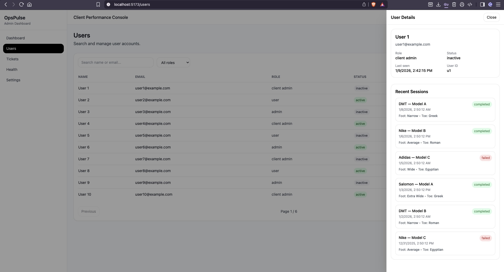
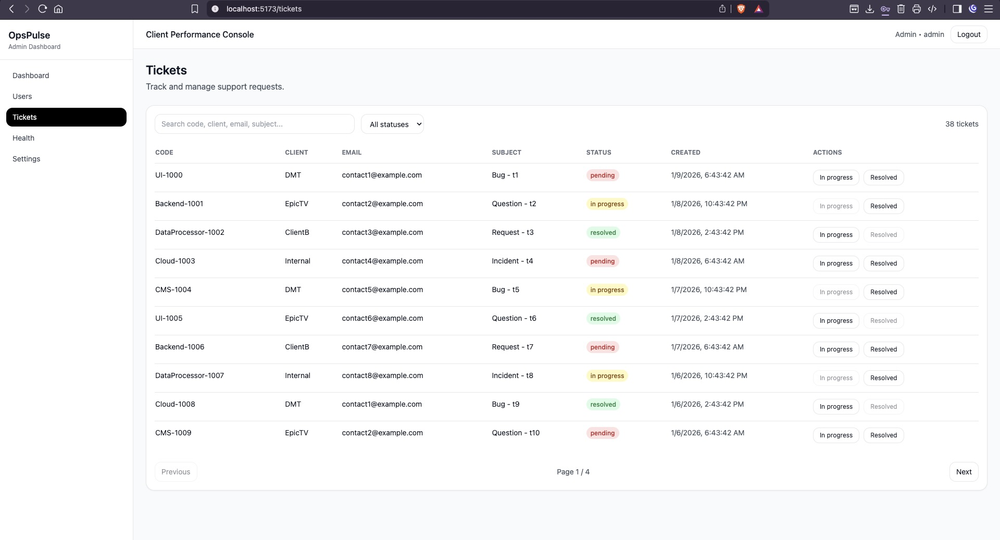
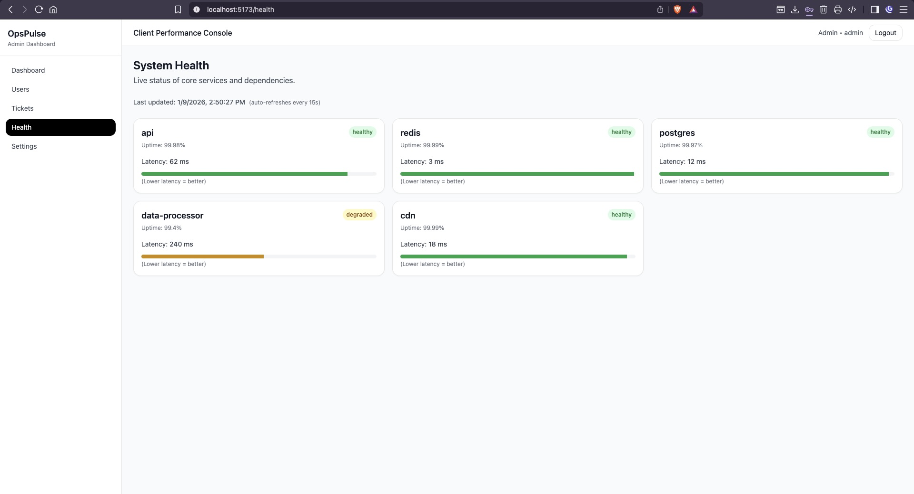
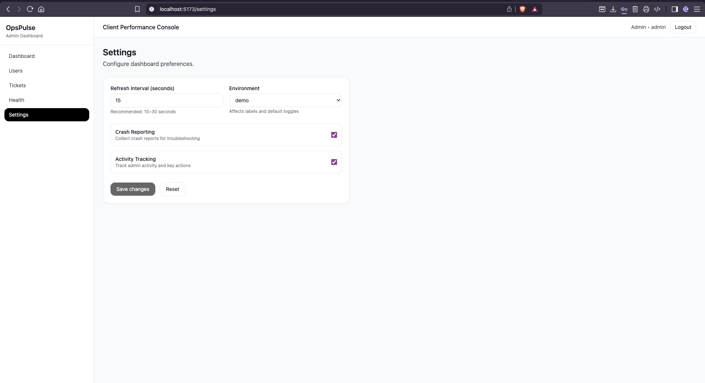

# OpsPulse — SaaS Admin Dashboard (Frontend)

A modern **SaaS Admin Dashboard** built with **React + TypeScript + Vite + TailwindCSS**, featuring **mocked APIs with MSW**, protected routes, KPI dashboard charts, users management with a drawer, ticket workflow, and system health + settings pages.

---

## Screenshots

> Add the screenshots under `docs/screenshots/` and keep these paths.









---

## Features

### Auth & Routing
- Login page with token-based session (mocked)
- Protected routes (redirects to `/login` when not authenticated)
- Logout clears session and redirects

### Dashboard
- KPI cards (Active Users, Sessions, Crashes, Conversion)
- Trend charts (Line + Bar) using Recharts
- Range selector (7d / 14d / 30d)
- Recent activity feed
- Loading skeletons + error states

### Users
- Search + role filtering + pagination
- Row click opens a **User Drawer**
- Drawer supports:
  - Close via overlay click
  - Close via **Esc**
  - Body scroll lock
  - Sessions list per user

### Tickets
- Search + status filter + pagination
- Status update actions (`pending` → `in progress` → `resolved`)
- Toast feedback after actions

### System Health & Settings
- Simple data pages with consistent UX patterns
- Loading + error states

---

## Tech Stack

- **React + TypeScript**
- **Vite**
- **TailwindCSS**
- **React Router**
- **@tanstack/react-query**
- **@tanstack/react-table**
- **Recharts**
- **MSW (Mock Service Worker)** for API mocking in development

---

## Getting Started

### Install
```bash
npm install